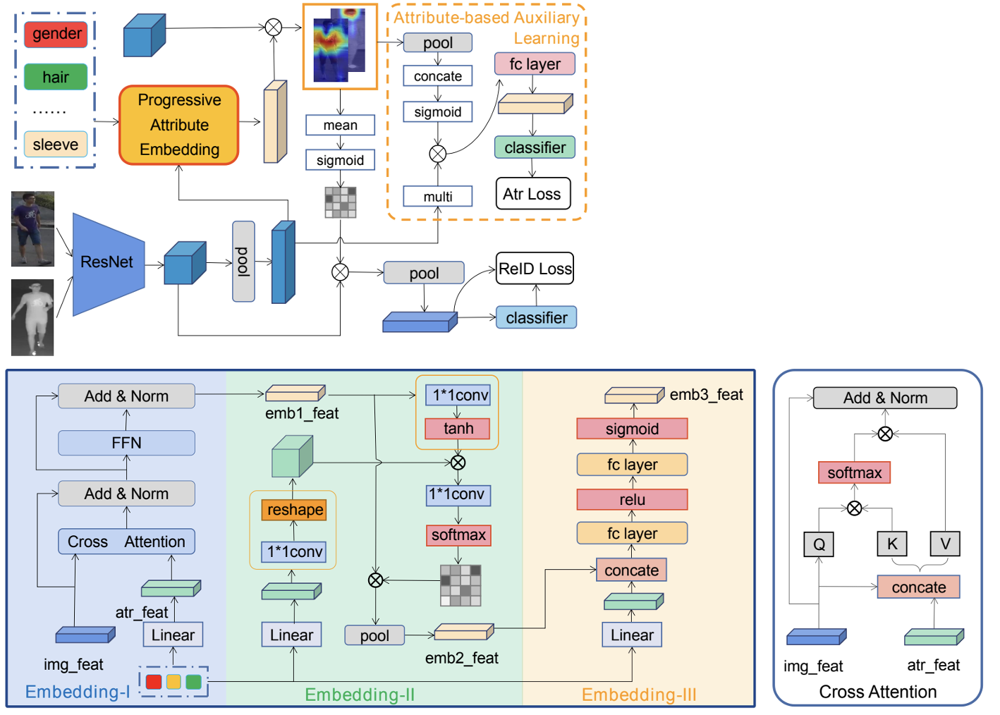

# 🎈🎈🎈 Progressive Attribute Embedding for Accurate Cross-modality Person Re-ID
This repository is an official implementation of the paper [PAENet](https://aihuazheng.github.io/publications/pdf/2022/2022-Progressive%20Attribute%20Embedding%20for%20Accurate%20Cross-modality%20Person%20Re-identification.pdf).

## 🌟 Update

1. Released the attribute labels for the **RegDB** and **SYSU-MM01** datasets used in our paper. [[DOWNLOAD](./PAENet_Attribute.zip)]

## ☀️ Introduction


**Abstract.** Attributes are important information to bridge the appearance gap across modalities, but have not been well explored in cross-modality person ReID. This paper proposes a progressive attribute embedding module (PAE) to effectively fuse the fine-grained semantic attribute information and the global structural visual information. Through a novel cascade way, we use attribute information to learn the relationship between the person images in different modalities, which significantly relieves the modality heterogeneity. Meanwhile, by embedding attribute information to guide more discriminative image feature generation, it simultaneously reduces the inter-class similarity and the intra-class discrepancy. In addition, we propose an attribute-based auxiliary learning strategy (AAL) to supervise the network to learn modality-invariant and identity-specific local features by joint attribute and identity classification losses. The PAE and AAL are jointly optimized in an end-to-end framework, namely, progressive attribute embedding network (PAENet). One can plug PAE and AAL into current mainstream models, as we implement them in five cross-modality person ReID frameworks to further boost the performance. Extensive experiments on public datasets demonstrate the effectiveness of the proposed method against the state-of-the-art cross-modality person ReID methods.

### 🛠️ How to use this code: 
### 🔧 Training: 
```
python train_mine.py --dataset sysu --gpu 1 --pcb off --share_net 3 --batch-size 4 --num_pos 4 --dist_disc 'margin_mmd' --margin_mmd 1.40 --run_name 'margin_mmd1.40'
```

### 🪄 Testing:
```
python test.py --dataset sysu --gpu 0 --pcb off --share_net 3 --batch-size 4 --num_pos 4 --run_name 'margin_mmd1.40'
```


### 📑 Citing PAENet
If you find PAENet useful in your research, please consider citing:

```
@inproceedings{aihuazheng2022PAEnet,
  title={Progressive Attribute Embedding for Accurate Cross-modality Person Re-ID},
  author={Aihua Zheng, Peng Pan, Hongchao Li, Chenglong Li, Bin Luo, Chang Tan, Ruoran Jia},
  booktitle={{MM} '22: The 30th {ACM} International Conference on Multimedia, Lisboa, Portugal, October 10 - 14, 2022},
  year={2022},
  pages={4309--4317},
  publisher = {{ACM}},
  url={https://doi.org/10.1145/3503161.3548336},
  doi={10.1145/3503161.3548336}
}
```